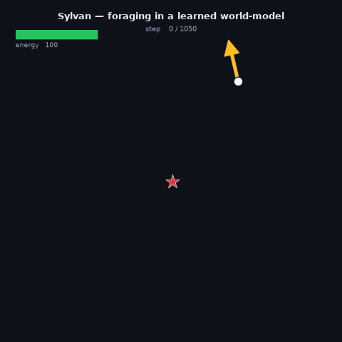
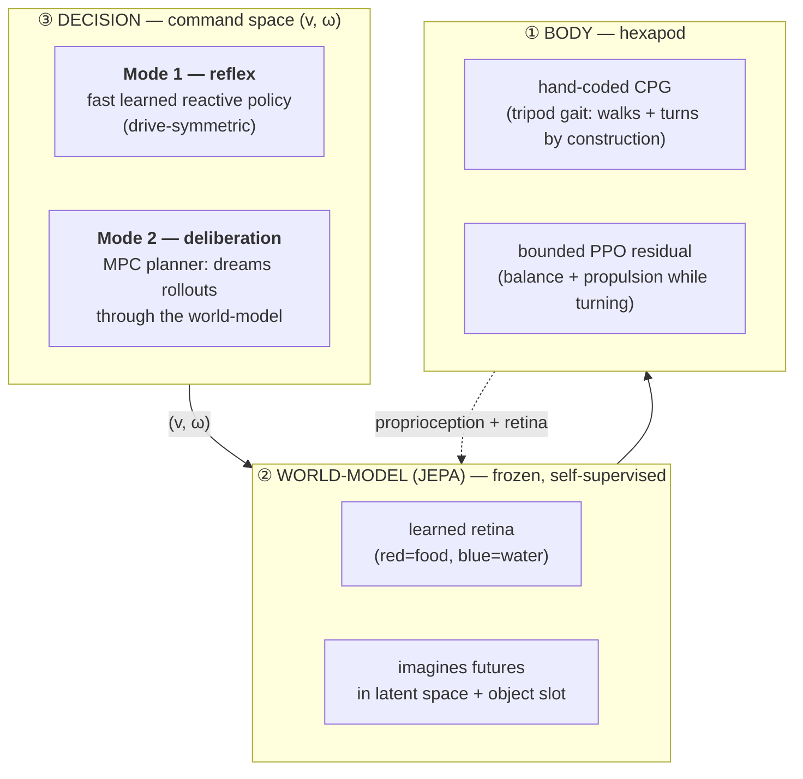

# Sylvan — Emergent survival in a learned world-model

> A small embodied agent that learns to **decide for itself** — *get hungry → look → go to food → survive* — by **planning inside a JEPA-style world-model it learned from its own experience.** Locomotion is only a prerequisite; the goal is emergent, homeostatic behavior.

<p align="center">
  
</p>

<p align="center"><i>The agent perceives resources, navigates to them, and arbitrates two competing drives (hunger &amp; thirst) to stay alive.</i></p>

---

## What this is (in 3 sentences)

Sylvan is a research prototype of **artificial life inside a world-model**: a six-legged creature in a physics simulation (Godot + PyTorch, CPU) that must keep two internal drives — **hunger and thirst** — above zero by finding and consuming food (red) and water (blue). It perceives the world through a **learned retina**, imagines the future through a **self-supervised world-model**, and chooses where to go in a compact **command space** `(v, ω)`. The organizing idea is a **dual-process brain** (à la Kahneman / LeCun's H-JEPA): a fast **reflex** and a slow **deliberation** that plans through the world-model.

## The research question

> Can survival behavior — perceiving, navigating, and **arbitrating competing needs over time** — *emerge* from an agent that plans inside a world-model it learned itself, rather than being hand-scripted?

This is deliberately harder than "reach the goal": the agent must trade off *"drink now vs. eat later"* with **look-ahead**, and do it from **learned perception**, on a body it must first learn to control.

## Architecture — three layers + a dual-process brain

The design cleanly separates **what to do** (body-agnostic, learned) from **how to move the limbs** (body-specific). The interface between them is a 2-D **command** `(v, ω)` = *(forward speed, turn rate)*.



**① Body.** A hexapod whose gait is a **hand-coded CPG** (walks and steers *by construction*), corrected by a **small, bounded PPO residual** for balance and speed. Turning is kinematics, not a reward gradient — which sidesteps the classic "the turn freezes" failure of end-to-end legged RL. *(≈ 3× the speed of the earlier quadruped, 0% falls.)*

**② World-model (JEPA).** A model trained **self-supervised, by prediction in latent space** — the substrate. It perceives via a **learned retina** (color-gated depth rays; no oracle) and can **imagine** how the world evolves under a command. It stays **frozen and task-agnostic**: the reward never touches it. *(Functionally JEPA; see the honesty note below.)*

**③ Decision** happens in command space, as a **dual process**:
- **Mode 2 (deliberation)** — a receding-horizon **planner** that dreams candidate `(v, ω)` sequences through the world-model and picks the one that best keeps the agent alive. This is the "thinking" agent: it arbitrates food vs. water *with foresight*.
- **Mode 1 (reflex)** — a fast **learned reactive policy** (drive-symmetric: adding a drive = plugging in a token, no retrain). It approximates Mode 2 for the common cases.

Consolidation (planned): **Mode 2 → Mode 1 at night** (behavioral cloning) — the reflex absorbs the deliberation over a lifetime, exactly the H-JEPA loop.

## Why the design is interesting

- **Plan in a learned world-model** (JEPA-style), not model-free trial-and-error — the deliberation *imagines* consequences.
- **Command-space interface** `(v, ω)`: change the *body* → retrain only the low-level driver; the *mind* transfers.
- **Drive-symmetric policy**: needs are interchangeable tokens → adding a drive is architecture-free.
- **Purity discipline**: the world-model is the slow, general substrate; reward only ever touches fast heads. Impurities are *named*, not hidden (see below).
- **Diagnostic-driven methodology** (below) — arguably the project's strongest asset.

## Method — diagnose before you train

A hard rule of this project: **never launch an hours-long run on a hunch.** Every expensive step is gated behind a **free, falsifiable diagnostic** that localizes the bottleneck first, with success/kill criteria written *before* running. Negative results are treated as first-class findings and are documented, not buried.

A representative slice of the current frontier (multi-drive arbitration):

| Gate (free) | Question | Verdict |
|---|---|---|
| death-cause | Why does the reflex die? | **96 % decisions** (not the motor — refuted on data) |
| G1 | Does the world-model's *dreamed* latent carry water? | ✅ yes, and it transports through the dream |
| G2 | Can a survival-value on that latent *arbitrate*? | ❌ predicts survival but the open-loop dream is direction-blind → points to an object-slot |
| bridge | Does a "panic and defer to deliberation" trigger rescue the reflex? | ❌ too late — motivates a *principled* (uncertainty/surprise) trigger |

These honest negatives are what *shaped* the architecture — each one is a commit with the probe that produced it.

## Status

- ✅ **Body**: hexapod walks/turns, banked.
- ✅ **World-model + planner**: the agent perceives → imagines → navigates → **eats/drinks → survives** (single- and multi-drive).
- ✅ **Mode 2 (deliberation)** is a coherent, foresightful arbiter today.
- 🔬 **Current frontier**: making the arbitration **learned and pure** (a survival-value / object-slot replacing the hand-designed planner cost), and wiring the **Mode 1 ↔ Mode 2 bridge** with a principled trigger.

This is a **research prototype**, not a product: it is meant to *investigate* emergent embodied cognition, and it wears its open problems on its sleeve.

## Honesty notes (kept deliberately visible)

- **"JEPA"** here is *functional*, not doctrinaire: the world-model was de-collapsed and shifted toward latent-space prediction (VICReg + latent loss), but it is not a strict LeCun JEPA. The substrate is kept self-supervised and frozen — that is the property that matters.
- The current multi-drive planner still tracks the **drive levels analytically** (a hand-coded piece). The pure version — a **learned drive-dynamics head** on the latent — is a *named* debt, on the roadmap, not swept under the rug.

## Repository layout

```
godot/            # physics + environment (Godot 4, Jolt): hexapod body, drives, resources
python/sylvan/    # the brain
  ├── models/       # world-model, retina, value/slot heads
  └── control/      # CPG+residual, PPO, the planner (Mode 2), Mode 1 policy
diagnostics/      # the free, falsifiable probes (diag_*.py) that gate every run
scripts/          # run / train / evaluate scripts (a foraging episode, world-model cycle, …)
docs/             # design docs (the "why" behind each decision) + the blueprint
tools/archi_hud/  # a live, clickable map of the architecture's state (voir_archi.sh)
```

## Running it

The full pipeline runs on **CPU** (`env_pytorch_3.12`), driven from Godot headless + Python servers. Heavy artifacts (checkpoints, replay buffers — ~10 GB) are **regenerable and git-ignored**, so a fresh clone is a *readable showcase*, not a one-command reproduction. Entry points live in `scripts/` (e.g. a foraging episode, a world-model eval) and each `diagnostics/diag_*.py` is a self-contained, self-checking probe.

---

<p align="center"><i>Built as a solo research project exploring emergent, embodied cognition in a learned world-model.</i></p>
