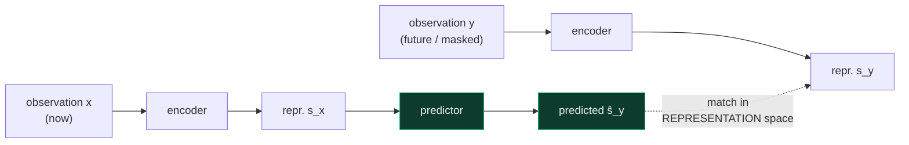
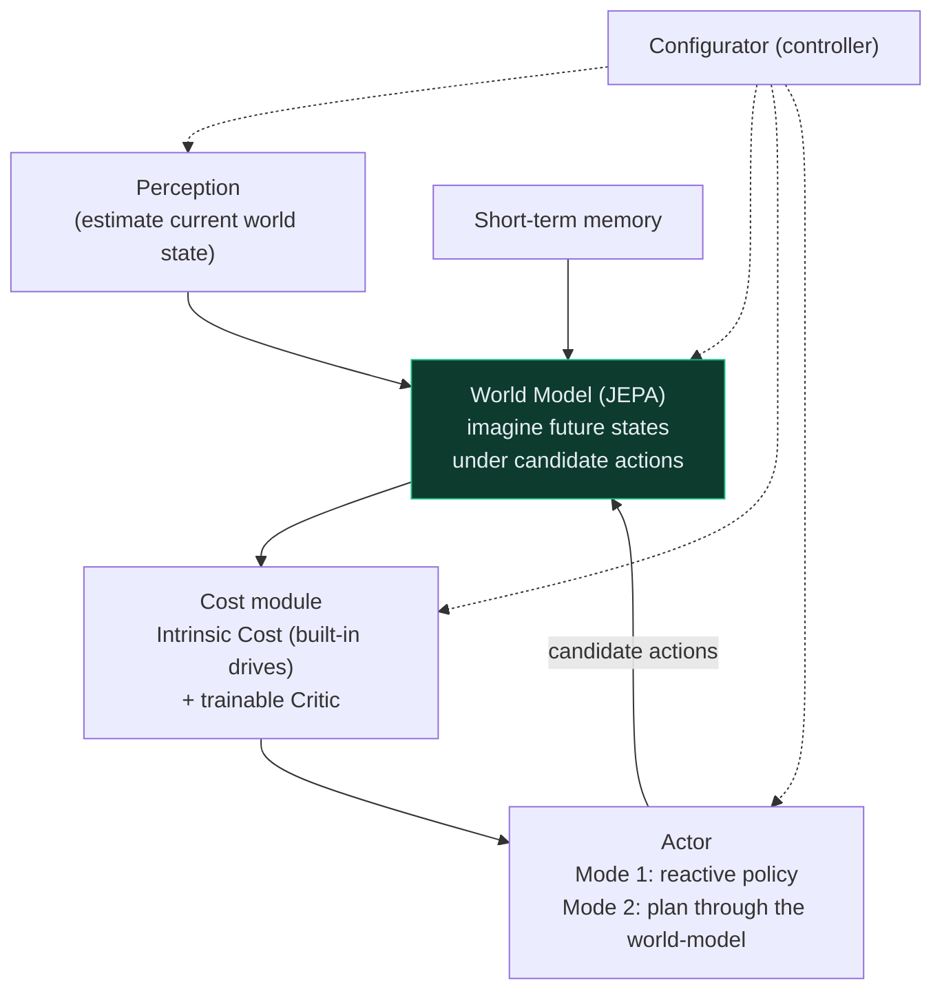
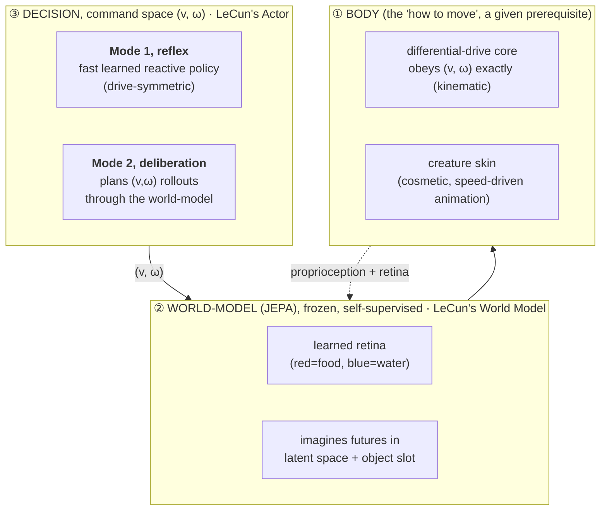

# Sylvan : Emergent survival in a learned world-model

> An embodied agent that learns to **decide for itself** : *get hungry → look → go to food → survive*, by **planning inside a world-model it learned from its own experience**, in the spirit of Yann LeCun's blueprint for autonomous machine intelligence.

<p align="center">
  
</p>

<p align="center"><i>The real simulation: the agent perceives resources (red = food, blue = water) and arbitrates two competing drives to stay alive.</i></p>

---

## The goal

Most agents are told what to do. The goal here is the opposite: an agent whose behavior **emerges** from a few built-in needs and a model of the world it learns on its own.

Concretely, the target is an agent that:
- has **several competing drives** (hunger, thirst, …) and must **arbitrate between them over time**, *"drink now, or eat first?"*, with genuine look-ahead;
- **perceives** the world through learned senses (no hand-labeled oracle);
- learns its model of the world **self-supervised**, from raw experience, with no external reward telling it what a "good" state is;
- **plans** by imagining consequences inside that model, rather than reacting reflexively or being scripted.

This is a small, embodied step toward the research program Yann LeCun laid out for **autonomous machine intelligence**, so it's worth starting with that blueprint before the specifics.

---

## Background: JEPA and LeCun's blueprint

In *[A Path Towards Autonomous Machine Intelligence](https://openreview.net/pdf?id=BZ5a1r-kVsf)* (LeCun, 2022), the path to agents that can perceive, reason, and plan runs through a **learned world-model**, trained **self-supervised**, and used for **planning**, not through ever-larger reactive/generative models. Two ideas matter here.

### 1. JEPA, predict in representation space, not pixel space

A **Joint Embedding Predictive Architecture (JEPA)** learns by predicting the **embedding** of a missing/future part of the world from the embedding of the observed part, in an *abstract representation space*, **not** by reconstructing raw pixels or tokens. Two related inputs are encoded; a predictor maps one representation to the other.



Why it matters: predicting in representation space lets the encoder **throw away unpredictable, irrelevant detail** (every leaf, every ripple) and keep only what's useful, avoiding the trap of generative models that must render every pixel. It is **self-supervised** (the signal is the world's own structure, no labels, no reward) and is formulated as an **[energy-based model](https://arxiv.org/abs/2306.02572)**. Meta's [I-JEPA / V-JEPA line](https://arxiv.org/pdf/2506.09985) shows the same principle scaling to images and video, including **planning** from learned video world-models.

**Hierarchical JEPA (H-JEPA)** stacks this: lower levels keep fine detail for short-horizon prediction; higher levels form coarser, abstract representations for **longer-horizon planning**.

### 2. A cognitive architecture built around that world-model

LeCun frames the whole agent as a set of differentiable modules organized around the world-model:



- **Perception** turns observations into a world-state estimate.
- The **World Model** predicts how that state evolves under *imagined* actions.
- The **Cost module** = an immutable **Intrinsic Cost** (the agent's built-in drives / "motivations") plus a **trainable Critic** that predicts future cost. *Behavior is driven by intrinsic motivation, not an external reward.*
- The **Actor** produces actions in two modes: **Mode 1** : a fast **reactive** policy; **Mode 2** : **deliberation**, by optimizing an action sequence *through the world-model* to minimize predicted future cost.
- The **Configurator** orchestrates the rest for the task at hand.

A key detail: the world-model stays **self-supervised** and reward-free, it's the general substrate. Reward/cost only ever touches the *fast* modules (critic, actor). And a good agent keeps **both** Mode 1 and Mode 2: the reflex for speed, deliberation for the hard cases, and, over a lifetime, **the reflex is trained to imitate the deliberation** (amortized inference).

---

## Sylvan: a concrete, embodied instantiation

Sylvan takes those ideas and makes them **run** on a physical body, on a laptop CPU. It is a creature in a physics simulation (Godot + PyTorch) that must keep **hunger and thirst** above zero by finding food (red) and water (blue).

The design separates **what to do** (learned, body-agnostic) from **how to move** (a given prerequisite), with a compact 2-D **command** `(v, ω)` = *(forward speed, turn rate)* as the interface between them. Locomotion is deliberately out of scope (a prerequisite, not the research): the body obeys `(v, ω)` kinematically, which keeps the substrate clean and lets the whole `(v, ω)` cognitive stack stay body-agnostic.



| LeCun's blueprint | Sylvan's instantiation |
|---|---|
| World Model (JEPA), self-supervised | a frozen world-model trained by latent-space prediction; perceives via a **learned retina**; imagines futures + an object-centric **slot** |
| Intrinsic Cost / built-in drives | **hunger & thirst** as body properties; plans are scored by **simulated survival** (zero tuned weights); the fully *learned* critic is the current frontier |
| Actor, Mode 1 & Mode 2 | **Mode 2** = a receding-horizon planner that dreams `(v,ω)` rollouts through the world-model; **Mode 1** = a fast **drive-symmetric** reactive policy |
| Mode 2 → Mode 1 consolidation | the reflex is trained to **imitate** the planner (behavioral cloning) |

**① Body.** Locomotion is a **given kinematic prerequisite**: the body obeys the `(v, ω)` command exactly (a differential-drive core, stable, able to turn in place), so far-target navigation is not a bottleneck (far resources at 5 to 8 m are reached about 75 % of the time). It is cosmetically skinned as a low-poly creature whose walk animation is driven by its speed. Keeping the legs out of the control loop is deliberate: locomotion is a means, not the object of study, and abstracting it keeps the substrate clean for the cognition above.

**② World-model.** Trained **self-supervised by prediction in latent space**, the slow, general substrate. It perceives through a **learned retina** (color-gated depth rays; no oracle) and can **imagine** how the world evolves under a command. It stays **frozen and task-agnostic**: the reward never touches it.

**③ Decision** happens in command space, as a **dual process**: **Mode 2** dreams candidate `(v, ω)` sequences through the world-model and picks the one that best keeps the agent alive (this is the "thinking" agent, it arbitrates food vs. water *with foresight*); **Mode 1** is a fast reflex that approximates it. **Drive-symmetric**: adding a drive = plugging in a token, no retrain.

---

## Method: diagnose before you train

A hard rule of this project: **never launch an hours-long run on a hunch.** Every expensive step is gated behind a **free, falsifiable diagnostic** that localizes the bottleneck first, with success/kill criteria written *before* running. Negative results are first-class findings, documented, not buried.

A representative slice of the current frontier (multi-drive arbitration):

| Gate (free) | Question | Verdict |
|---|---|---|
| death-cause | Why does the reflex die? | **96 % decisions** (not the motor, refuted on data) |
| G1 | Does the world-model's *dreamed* latent carry water? | PASS: yes, and it transports through the dream |
| G2 | Can a survival-value on that latent *arbitrate*? | FAIL: predicts survival, but the open-loop dream is direction-blind → points to an object-slot |
| bridge | Does a "panic and defer to deliberation" trigger rescue the reflex? | FAIL: too late, motivates a *principled* (uncertainty/surprise) trigger |
| B0 | Does a learned static value arbitrate on explicit coordinates? | FAIL at chance; but a look-ahead simulating the consumption event arbitrates at 0.90 to 0.96: arbitration lives in the rollout, not in a static value |
| coords | Why does the planner wander while everything is visible? | The food slot was out of distribution in multi-resource worlds: the planner chased phantom positions (2 to 4 m off). Causal intervention: +520 median survival in the dense world |
| slot-2 | Can a two-resource slot reach sensor-floor accuracy without labels? | PASS with a zero-parameter geometric readout (0.35 m food, 0.84 m water); the learned scorer was the destabilizer (7 diagnosed pathological optima) |
| critic | Can a critic learned from lived episodes replace the hand-coded survival tail? | Offline: 4/4 gates PASS (AUC 0.995, non-saturation, arbitration 0.95). Closed loop: 3 diagnosed negatives, an imitation ceiling: its corpus lacks far-pursuit successes, so consolidation (the day/night cycle) is the prerequisite |

Each honest negative *shaped* the architecture, and each is a commit with the probe that produced it.

## Status

- **Body & locomotion**: a given kinematic prerequisite. The body obeys `(v, ω)` exactly and reaches far resources (5 to 8 m) about 75 % of the time. Cosmetically skinned as a low-poly wolf, animated by its speed.
- **Perception**: both resources located by the world-model's own learned slots (color-queried, label-free); the last perception oracle (a water radar) was removed. A per-resource spatial memory gives object permanence across replans (dead-reckoned by a learned ego-motion head).
- **Mode 2 (deliberation)**: the planner imagines `(v, ω)` rollouts through the world-model and scores each by a **critic learned from lived experience** (LeCun's trainable critic), reading the world-model's own object-centric slots. No hand-coded steering and no per-resource oracle remain in the loop: hunger and thirst are perceived symmetrically, and a resource out of view is simply unknown. The pure loop forages in balance in the sparse world and saturates the episode with no deaths in the dense one. Offline, the learned value matches the analytic survival simulation it replaces (held-out AUC 0.99, arbitration 0.90).
- **Current frontier**: **continual learning**, the day/night cycle (live by day, retrain the critic and re-distill the reflex by night), which is the blueprint's lifelong-learning stage; and lifting the sparse-world survival ceiling, which is set by the body's metabolism, not the decision. The slot's position readout is still a hand-designed geometry (a learned readout destabilised it), a deeper frontier shared by both drives. See `docs/audit_lecun_2026-07-06.md` for the full purity audit against the blueprint.

A **research prototype**, meant to *investigate* emergent embodied cognition, it wears its open problems on its sleeve.

## Honesty notes (kept deliberately visible)

- **"JEPA" here is *functional*, not doctrinaire**: the world-model was de-collapsed and shifted toward latent-space prediction (VICReg + a latent loss), but it is not a strict JEPA. The property that matters, a self-supervised, frozen substrate, is preserved.
- The current multi-drive planner still tracks the **drive levels analytically** (a hand-coded piece). The pure version, a **learned drive-dynamics head** on the latent, is a *named* debt on the roadmap, not swept under the rug.
- **Locomotion is given, not learned**: the body's motion is a kinematic `(v, ω)` prerequisite and the creature skin is cosmetic. No claim is made of an emergent legged gait; the research is entirely upstream (perception, world-model, planning, drives).

## Repository layout

```
godot/        # physics + environment (Godot 4, Jolt): kinematic body + creature asset, drives, resources
python/sylvan/  # the brain, models/ (world-model, retina, value/slot heads) + control/ (locomotion, planner, Mode-1 policy)
diagnostics/  # the free, falsifiable probes (diag_*.py) that gate every run
scripts/      # run / train / evaluate scripts
docs/         # design docs (the "why" behind each decision) + the blueprint
tools/        # the live architecture map + the visualization scripts
```

The full pipeline runs on **CPU**. Heavy artifacts (checkpoints, replay buffers) are regenerable and git-ignored, so a fresh clone is a **readable showcase**, not a one-command reproduction.

---

<p align="center"><i>A solo research project exploring emergent, embodied cognition in a learned world-model.</i></p>
