# 🧠 Schéma complet — JEPA / AMI (LeCun) × projet Sylvan

> Rendu gratuit : colle un bloc dans **mermaid.live**, ou ouvre ce fichier dans **VS Code** avec
> l'extension *Markdown Preview Mermaid Support*, ou pousse-le sur **GitHub** (rendu natif).
> Pour rendre en PNG/SVG sans compte : `npx -y @mermaid-js/mermaid-cli -i docs/schema_jepa_sylvan.md -o schema.png`.
>
> Le doc va du **général (théorie JEPA)** au **particulier (notre implémentation)**, puis les **mappings**,
> le **WM en détail**, la **rétine**, le **planner**, les **pulsions**, et l'**état + roadmap**.

---

## 0. Vue d'ensemble — la thèse en une image

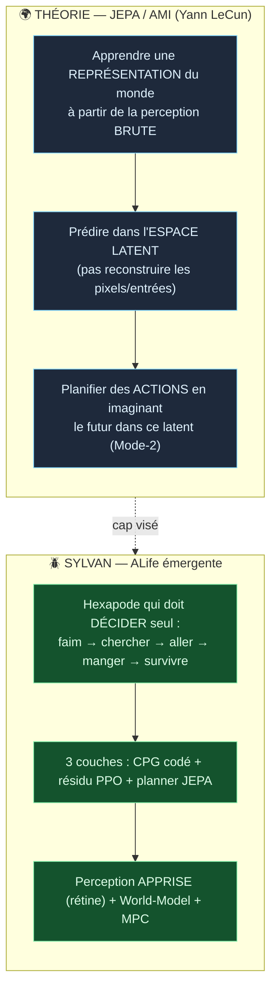

---

## 1. Concepts JEPA (le cœur théorique)

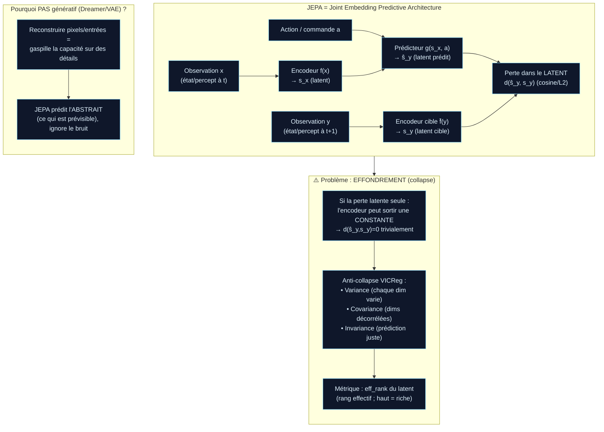

---

## 2. AMI — l'architecture cognitive cible de LeCun (et où on en est)

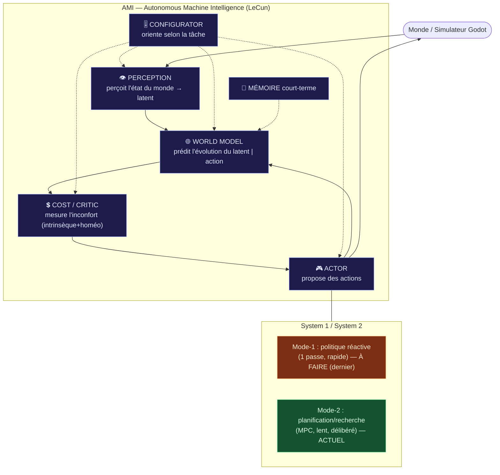

---

## 3. Sylvan — le PIPELINE 3 couches (l'architecture réelle)

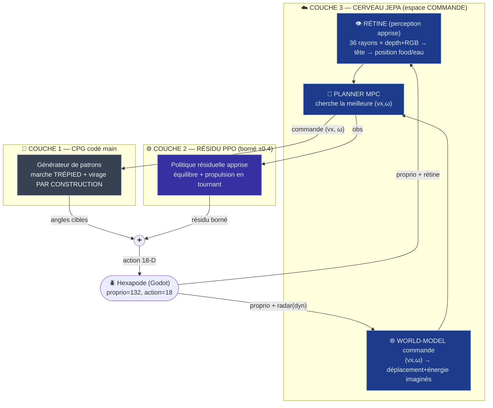

> **Principe clé (BLUEPRINT §14)** : le WM/planner raisonnent en **(vx, ω)** ; la « bouffe » ne vit
> QUE dans le **coût du planner** (agnosticité de la tâche). La locomotion est un *prérequis*, pas le but.

---

## 4. World-Model en détail (le moteur JEPA de Sylvan)

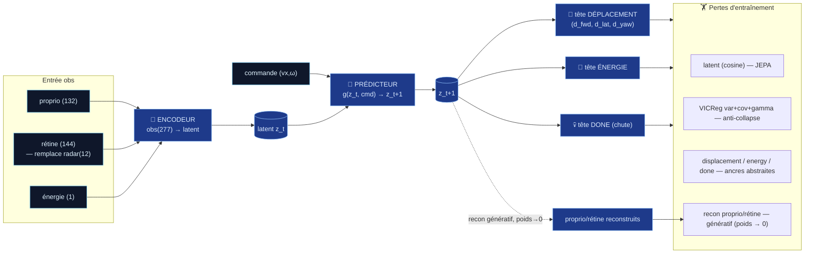

### Statut JEPA du WM (honnête)

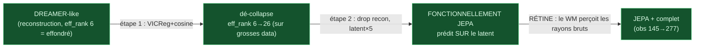

---

## 5. LA RÉTINE — perception apprise (le grand acquis récent)

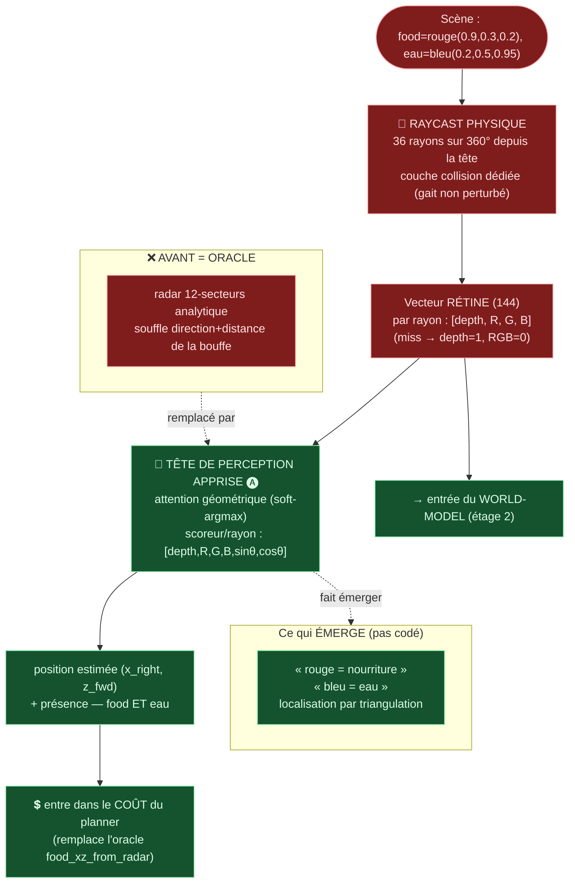

---

## 6. LE PLANNER MPC (Mode-2, recherche dans l'imaginaire)

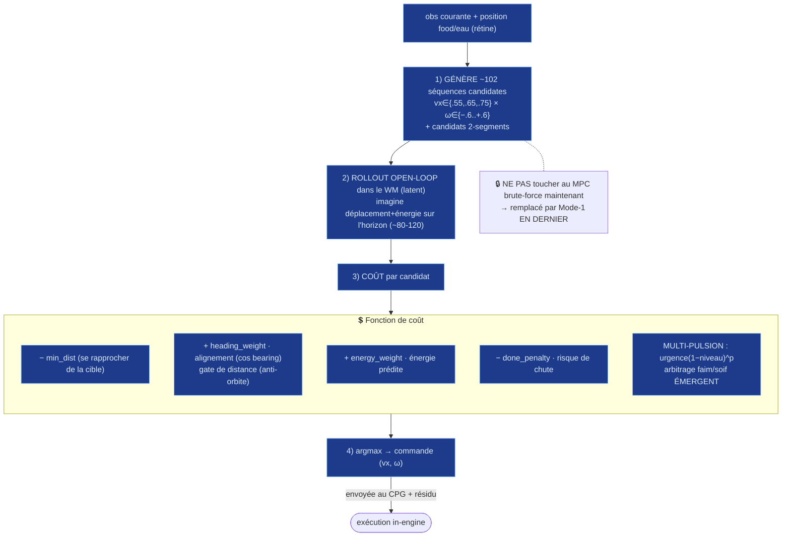

---

## 7. Pulsions / homéostasie (la boucle de survie ALife)

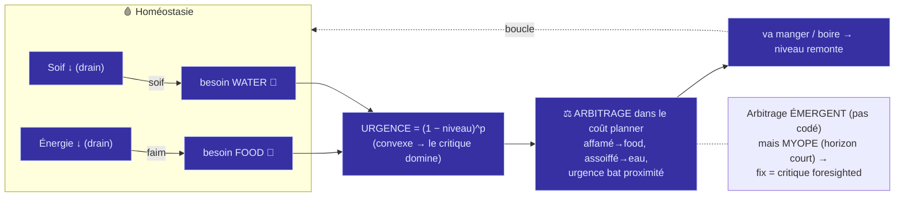

---

## 8. MAPPING — concept JEPA/AMI → composant Sylvan → statut

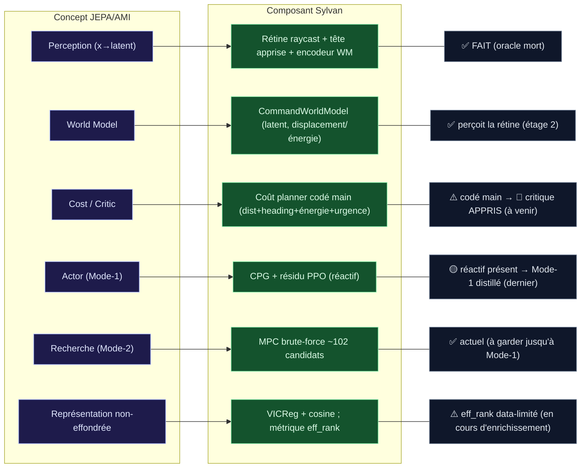

---

## 9. ÉTAT & ROADMAP (où on en est, où on va)

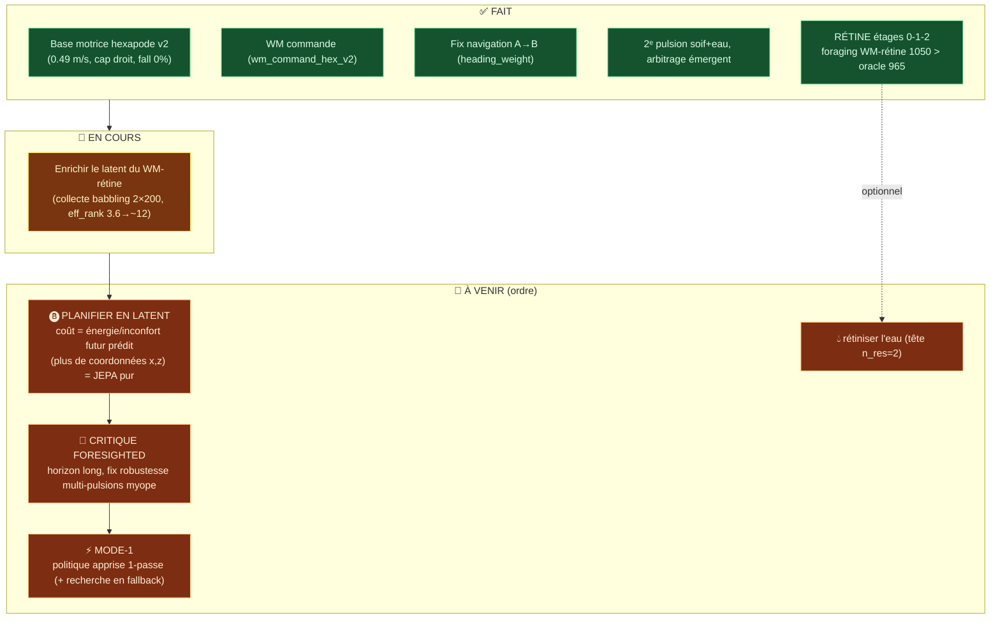

---

## 10. Dimensions & checkpoints (référence rapide)

| Élément | Valeur |
|---|---|
| proprio | **132** |
| action | **18** (6 pattes × 3 DOF) |
| obs policy | **144** (132 + vision-commande 12) |
| obs WM (radar) | **145** (132 + radar 12 + énergie 1) |
| obs WM (RÉTINE) | **277** (132 + rétine 144 + énergie 1) |
| rétine | **36 rayons × 4** (depth,R,G,B) = 144 |
| Base motrice | `data/checkpoints/hexapod_v2/policy_best.pt` |
| WM radar | `data/checkpoints/wm_command_hex_v2/wm_best.pt` |
| WM rétine (étage 2) | `data/checkpoints/wm_command_hex_retina_v1/wm_best.pt` |
| Tête perception 🅐 | `data/checkpoints/retina_head/head_best.pt` |

---

### Légende couleurs
🟦 théorie / cerveau JEPA · 🟩 fait / acquis · 🟧 à venir / en cours · 🟥 perception (rétine) ou ancien oracle.
